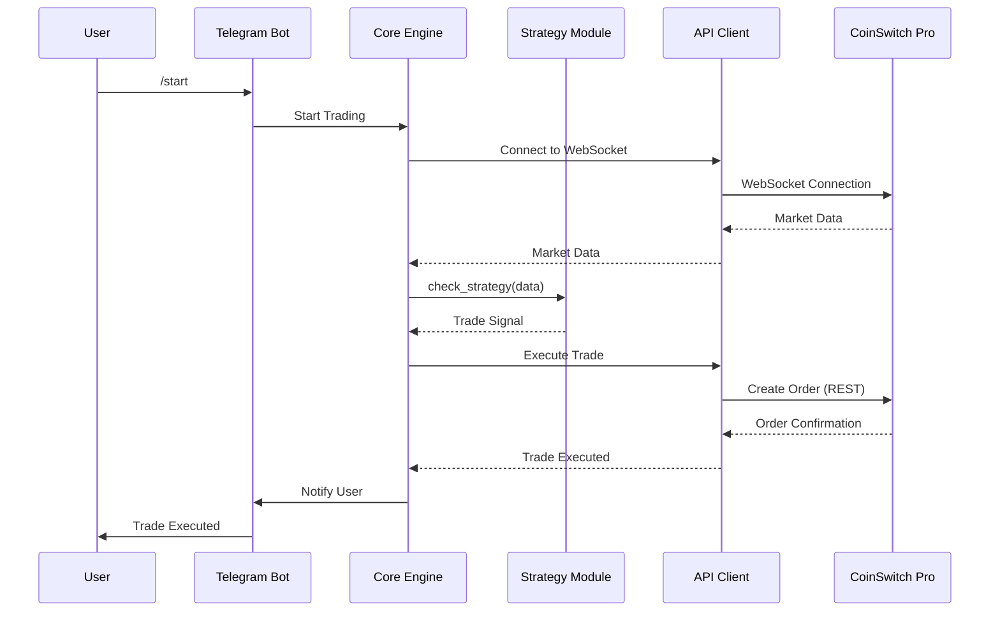

# Architecture

This document outlines the architecture of the Python Crypto Futures Trading Bot.

## Components

The bot is composed of the following main components:

*   **Core Engine**: The central component that orchestrates the bot's operations. It is responsible for loading the configuration, initializing the other components, and managing the main trading loop.
*   **API Client**: A dedicated module for interacting with the CoinSwitch Pro API. It handles both REST API requests for trading actions and WebSocket connections for real-time market data.
*   **Strategy Module**: A pluggable module where users define their trading strategies. The core engine dynamically loads and executes the strategy on each market data update.
*   **Telegram Bot**: An interface for controlling the bot via Telegram commands. It allows users to monitor the bot's status, check their account balance, and manage their positions.

## Diagram

